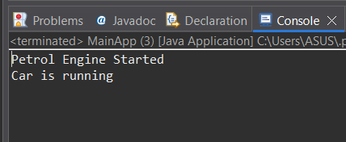

# 🚗 Spring Core – Car Engine Application (Java Config)

A simple **Spring Core Maven project** demonstrating **Dependency Injection (DI)** and **Inversion of Control (IoC)** using **Java-based configuration and annotations**.

This project explains how Spring manages object creation and dependency wiring without XML configuration.

---

## 📌 Project Overview

In this application, a `Car` depends on an `Engine` interface.  
Different engine implementations (`PetrolEngine`, `DieselEngine`) are injected into the `Car` class using Spring's annotation-based configuration.

The project focuses on:
- Loose coupling
- Clean architecture
- Spring Core fundamentals

---

## 🛠️ Technologies Used

- Java 11  
- Spring Core (Context)  
- Maven  
- Eclipse IDE  

---

## 📂 Project Structure
spring-core-car-engine-app
│
├── 📁 src
│   ├── 📁 main
│   │   ├── 📁 java
│   │   │   └── 📁 com/springcore
│   │   │       ├── 📁 car
│   │   │       │   └── Car.java
│   │   │       │
│   │   │       ├── 📁 engine
│   │   │       │   ├── Engine.java
│   │   │       │   ├── PetrolEngine.java
│   │   │       │   └── DieselEngine.java
│   │   │       │
│   │   │       ├── 📁 config
│   │   │       │   └── AppConfig.java
│   │   │       │
│   │   │       └── 📁 main
│   │   │           └── MainApp.java
│   │   │
│   │   └── 📁 resources
│   │
│   └── 📁 test
│       └── 📁 java
│
├── 📁 screenshots
│   └── output.png
│
├── 📄 README.md
├── 📄 .gitignore
└── 📄 pom.xml

---

## ⚙️ Core Concepts Demonstrated

- Dependency Injection (DI)
- Inversion of Control (IoC)
- Interface-based design
- Annotation-based configuration
- Java-based Spring configuration (`@Configuration`)
- Component scanning (`@ComponentScan`)
- Bean injection (`@Autowired`)

---

## 🔄 Application Flow

1. Application starts from `MainApp`
2. Spring container is initialized using `AnnotationConfigApplicationContext`
3. `AppConfig` scans all components
4. `Car` bean is created
5. `Engine` implementation is injected automatically
6. Engine starts and car runs

---

## ▶️ How to Run the Project

1. Clone the repository:
   ```bash
   git clone: https://github.com/mkmishra2503/spring-core-car-engine-app.git
   ```
2.Open the project in Eclipse                                                                                                                                                            
3.Make sure Java 11 is configured                                                                                                                              
4.Run: MainApp.java                                                                                                                                                                 

---

## 📸 Output Screenshot

Below is the console output of the application after running `MainApp.java`:



(Output may vary based on injected engine implementation)

---

## 🎯 Learning Purpose

- This project is created to:
- Understand Spring Core fundamentals
- Learn annotation-based configuration
- Practice clean and modular Java code
- Prepare for Java & Spring interviews

---

👨‍💻 Author

Mithilesh Kumar Mishra                                                                 
Java Developer | Spring Framework Learner

---

⭐ **Support**

⭐ If you found this project helpful, please give it a star to support and encourage my learning journey.
